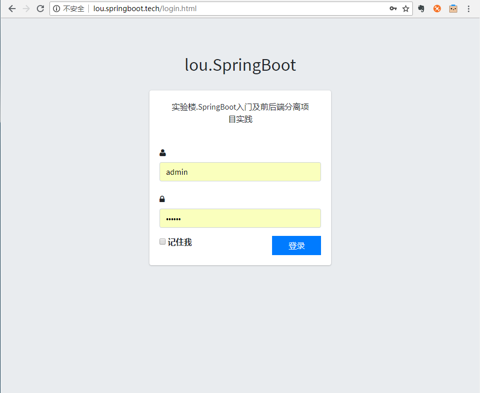
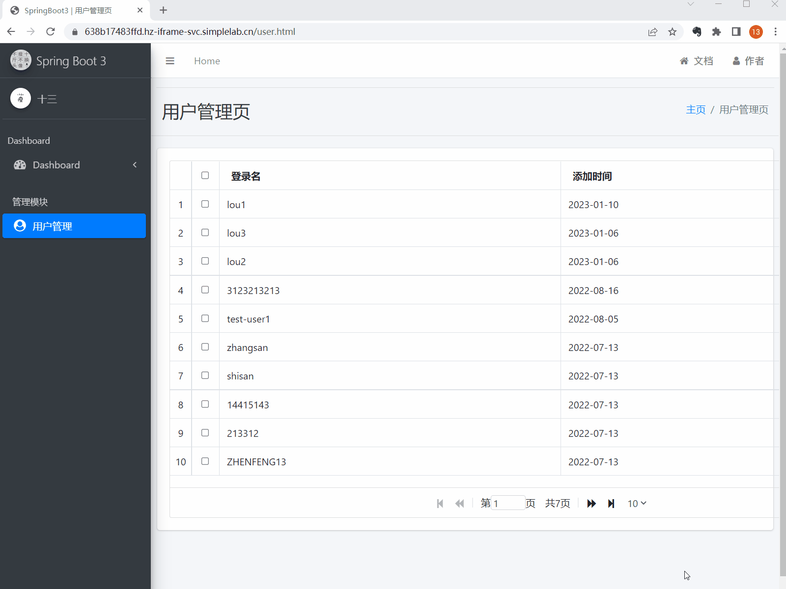
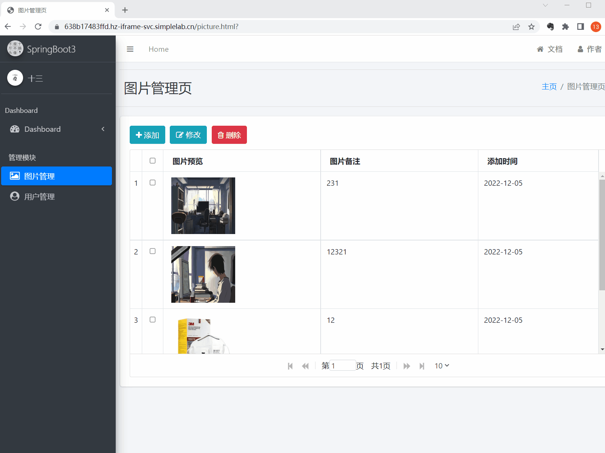
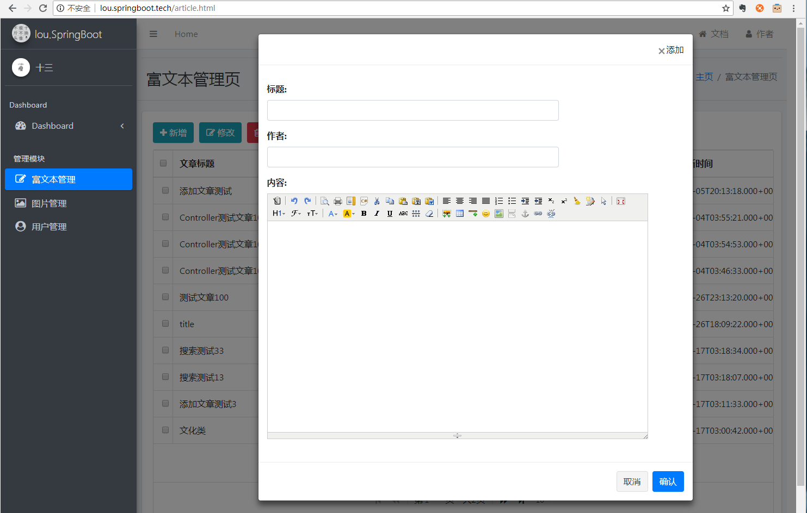

# Spring Boot 前后端分离实战项目源码

## 课程介绍

本课程是一个 Spring Boot 技术栈的实战类课程，课程共分为 3 个部分，当前仓库为课程的实战项目源码。前面两个部分为基础环境准备和相关概念介绍，第三个部分是 Spring Boot 项目实践开发。Spring Boot 介绍、前后端分离、API 规范等内容旨在让读者更加熟悉 SpringBoot 及企业开发中需要注意的事项并具有使用 SpringBoot 技术进行基本功能开发的能力；最后的项目实战为课程的主要部分，会带着大家实际的开发一个前后端分离的 Spring Boot 实践项目，让大家实际操作并从无到有开发一个线上项目，并学习到一定的开发经验以及其中的开发技巧，旨在让读者具有将 Spring Boot 真正应用于项目开发的能力；

## 课程地址

- [**课程地址:https://www.lanqiao.cn/courses/1244**](https://www.lanqiao.cn/courses/1244)

## 项目展示

以下为实践项目的页面和功能展示，分别为：

- 登录页面

- 列表页面(分页功能)

- 图片上传功能

- 富文本编辑器整合使用

实践项目的主要功能和页面就是这些，通过项目展示大家也能够感受到，在实际应用开发中的高频次功能都已经实现，稍加修改就可以运用到企业开发中，整个项目的开发模式为前后端分离的模式，即 Spring Boot 提供后端接口，前端页面通过 Ajax 异步调用接口的方式与后端服务器进行交互并将数据填充至页面中，这也是目前企业开发中比较重用的开发模式，希望大家能够了解并且能够实际的上手开发。

## 课程的五大特色

- 实践项目页面美观且实用，交互效果完美
- 包含从零搭建项目、功能开发到网站上线的完整流程
- 开发教程详细完整、文档资源齐全
- 代码+讲解+演示网站全方位保证，向 Hello World 教程说拜拜
- 丰富你的开发技术栈，提升个人市场价值

通过本课程你将学到以下内容：

- Spring Boot 3 技术栈的使用和开发技巧；
- MySQL 8 数据库的基本使用方法；
- Maven 的配置及使用；
- SpringBoot 基础 web 功能开发；
- SpringBoot 整合MyBatis；
- SpringBoot 文件上传；
- SpringBoot 全局异常处理；
- 前后端分离详解；
- AJAX 异步技术；
- AdminLTE3、Bootstrap 4、SweetAlert、JqGrid、JQuery 等前端框架组件及控件的使用；
- Swagger 在线 API 文档生成；
- Linux 系统部署及发布项目；
- 上线互联网项目的过程实践。

熟悉我的朋友应该都知道，我在写教程时一般都是“文章”+“源码”+“演示网站”同时提供的，因此在课程完结后，会将源码全部分享给每一位同学用于学习实践，本课程内容主要是抛砖引玉，根据该实践项目中所讲解的技术和开发技巧以及各个单独的功能点实现，可以结合自身业务将其改造成任何企业开发项目。

## 课程目录

- [**开篇词：SpringBoot入门及前后端分离项目实践导读**](https://www.lanqiao.cn/courses/1244)
- [第02课：快速认识 Spring Boot 技术栈](https://www.lanqiao.cn/courses/1244)
- [第03课：开发环境搭建](https://www.lanqiao.cn/courses/1244)
- [第04课：快速构建 Spring Boot 应用](https://www.lanqiao.cn/courses/1244)
- [第05课：Spring Boot 之基础 web 功能开发](https://www.lanqiao.cn/courses)
- [第06课：Spring Boot 之数据库连接操作](https://www.lanqiao.cn/courses/1244)
- [第07课：Spring Boot 整合 MyBatis 操作数据库](https://www.lanqiao.cn/courses/1244)
- [第08课：Spring Boot 处理文件上传及路径回显](https://www.lanqiao.cn/courses/1244)
- [第09课：Spring Boot 项目实践之前后端分离详解](https://www.lanqiao.cn/courses/1244)
- [第10课：Spring Boot 项目实践之 Ajax 技术使用教程](https://www.lanqiao.cn/courses/1244)
- [第11课：Spring Boot 项目实践之  RESTful API 设计与实现](https://www.lanqiao.cn/courses/1244)
- [第12课：Spring Boot 项目实践之登录模块实现](https://www.lanqiao.cn/courses/1244)
- [第13课：Spring Boot 项目实践之分页功能实现](https://www.lanqiao.cn/courses/1244)
- [第14课：Spring Boot 项目实践之 jqgrid 分页整合](https://www.lanqiao.cn/courses/1244)
- [第15课：Spring Boot 项目实践之用户编辑功能实现](https://www.lanqiao.cn/courses/1244)
- [第16课：Spring Boot 项目实践之用户管理模块实现](https://www.lanqiao.cn/courses/1244)
- [第17课：Spring Boot 项目实践之图片管理模块](https://www.lanqiao.cn/courses/1244)
- [第18课：Spring Boot 项目实践之信息管理模块实现](https://www.lanqiao.cn/courses/1244)

---

## 交流

> 大家有任何问题或者建议都可以在 [issues](https://github.com/ZHENFENG13/springboot-projects/issues) 中反馈给我，我会慢慢完善这个 Spring Boot 仓库。

- 我的邮箱：2449207463@qq.com
- QQ技术交流群：784785001