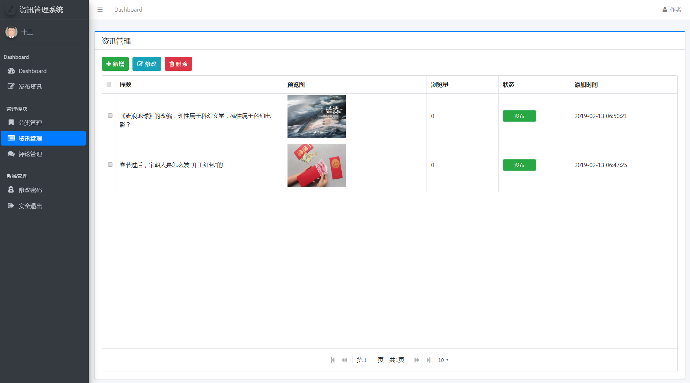
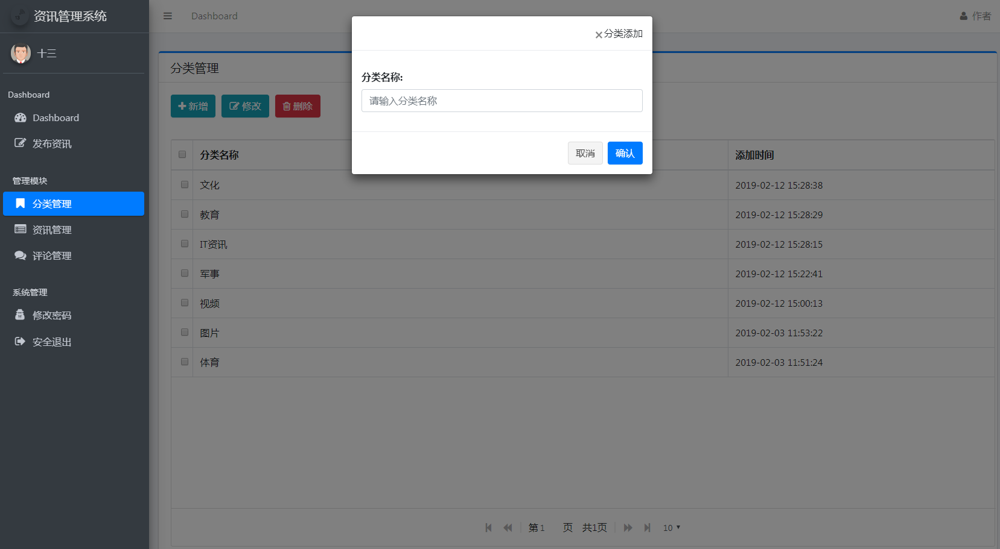
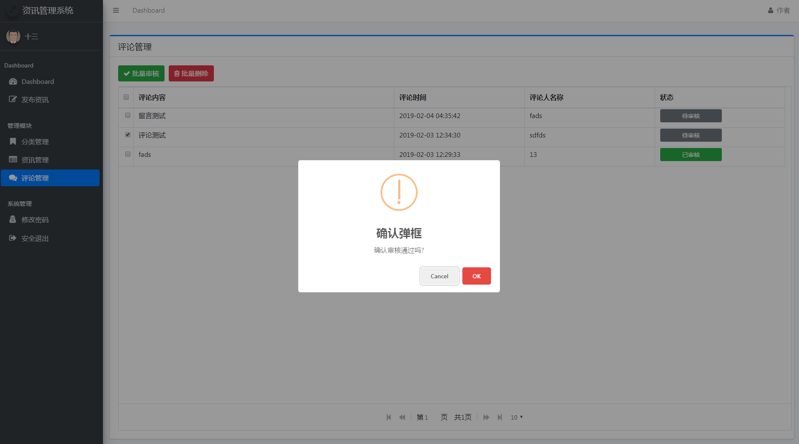
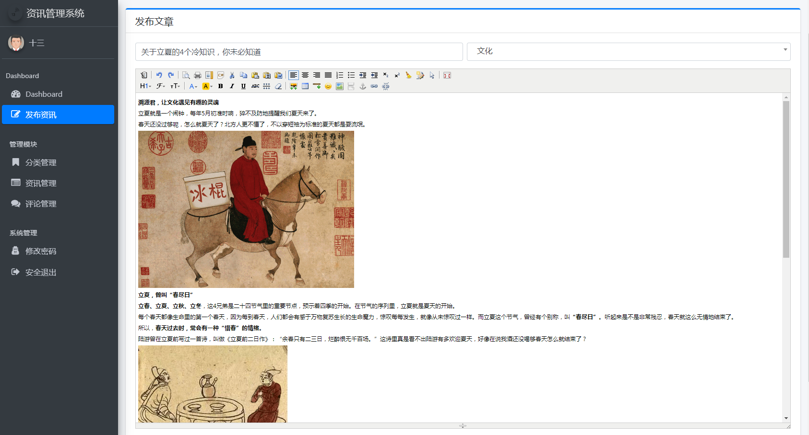

# Spring Boot 资讯发布系统实战项目源码

## 项目展示

以下为实践项目的页面和功能展示，分别为：

- 登录页面

- 列表页面(分页功能)

- 添加

- 修改

- 富文本编辑器整合使用

实践项目的主要功能和页面就是这些，通过项目展示大家也能够感受到，在实际应用开发中的高频次功能都已经实现，稍加修改就可以运用到企业开发中，希望大家能够了解并且能够实际的上手开发。

## 课程地址

- [**课程地址:https://www.shiyanlou.com/courses/1274**](https://www.shiyanlou.com/courses/1274)

## 课程的五大特色

- **课程内容紧贴 Spring Boot 技术栈，涵盖大部分 Spring Boot 使用场景**
- **开发教程详细完整、文档资源齐全、实验过程循序渐进简单明了**
- **实践项目页面美观且实用，交互效果完美**
- **包含从零搭建项目、功能开发到网站上线的完整流程**
- **丰富你的开发技术栈，提升个人市场价值**

本课程内容主要是抛砖引玉，根据该实践项目中所讲解的技术和开发技巧以及各个单独的功能点实现，可以结合自身业务将其改造成任何企业开发项目，关于整个课程中的所有知识点，我也整理了一个思维导图帮助大家更好的归纳和理解（如果网页上看不清楚的话可以放大查看）：

## 课程介绍

本课程是一个 Spring Boot 技术栈由入门到精通的实战类课程，课程共分为 6 个部分，本仓库中的代码为项目开发实战部分，如上图所示，主要课程分为：

- Spring Boot 基础开发
- Spring Boot web 开发
- Spring Boot 对于数据库的操作
- Spring Boot 使用扩展
- Spring Boot 项目的部署和监控
- Spring Boot + Thymeleaf + MyBatis + AdminLTE3 开发资讯发布系统

前面四个部分为基础环境准备以及 Spring Boot 项目实践开发，这些内容主要是为了让大家能够掌握 Spring Boot 的开发和使用，**旨在让读者更加熟悉 Spring Boot 及企业开发中需要注意的事项并具有使用 Spring Boot 技术进行大部分企业项目功能开发的能力；**第五部分是项目上线过程中的一些知识点整理以及上线后如何进行项目监控，**旨在让读者不仅仅能够开发 Spring Boot 项目，也能够实际的上线项目、监控项目、维护项目；**最后一部分为项目实践部分，我会带着大家实际的开发一个 Spring Boot + Thymeleaf + MyBatis + AdminLTE3  的资讯发布系统，让大家实际操作并从无到有开发一个线上项目，并学习到一定的开发经验以及其中的开发技巧，**旨在让读者具有将 Spring Boot 真正应用于项目开发的能力；**

## 课程目录

- [**开篇词：《23 个实验带你轻松玩转 Spring Boot》导读**](https://www.shiyanlou.com/courses/1274)
- [第02课：Spring Boot 项目开发环境搭建](https://www.shiyanlou.com/courses/1274/labs/10293/document)
- [第03课：快速构建 Spring Boot 应用](https://www.shiyanlou.com/courses/1274/labs/10294/document)
- [第04课：Spring Boot 基础功能开发](https://www.shiyanlou.com/courses/1274/labs/10295/document)
- [第05课：Spring Boot 项目开发之 web 项目开发讲解](https://www.shiyanlou.com/courses/1274/labs/10296/document)
- [第06课：Spring Boot 整合 JSP 开发 web 项目](https://www.shiyanlou.com/courses/1274/labs/10297/document)
- [第07课：模板引擎介绍及 Spring Boot 整合 Thymeleaf](https://www.shiyanlou.com/courses/1274/labs/10298/document)
- [第08课：Thymeleaf 语法详解](https://www.shiyanlou.com/courses/1274/labs/10299/document)
- [第09课：FreeMarker 模板引擎整合使用教程](https://www.shiyanlou.com/courses/1274/labs/10300/document)
- [第10课：Spring Boot 处理文件上传及路径回显](https://www.shiyanlou.com/courses/1274/labs/10301/document)
- [第11课：Spring Boot 自动配置数据源及操作数据库](https://www.shiyanlou.com/courses/1274/labs/10302/document)
- [第12课：Spring Boot 整合 Druid 数据源](https://www.shiyanlou.com/courses/1274/labs/10303/document)
- [第13课：Spring Boot 整合 MyBatis 操作数据库](https://www.shiyanlou.com/courses/1274/labs/10304/document)
- [第14课：Spring Boot 中的事务处理](https://www.shiyanlou.com/courses/1274/labs/10305/document)
- [第15课：Spring Boot 整合 Redis 操作缓存模块](https://www.shiyanlou.com/courses/1274/labs/10306/document)
- [第16课：Spring Boot 项目开发之实现定时任务](https://www.shiyanlou.com/courses/1274/labs/10307/document)
- [第17课：Spring Boot 自定义错误页面](https://www.shiyanlou.com/courses/1274/labs/10308/document)
- [第18课：Spring Boot 集成 Swagger 生成接口文档](https://www.shiyanlou.com/courses/1274/labs/10309/document)
- [第19课：Spring Boot 项目打包部署介绍](https://www.shiyanlou.com/courses/1274/labs/10310/document)
- [第20课：Spring Boot Admin 介绍及整合使用](https://www.shiyanlou.com/courses/1274/labs/10311/document)
- [第21课：Spring Boot 资讯管理信息系统开发实战(一)](https://www.shiyanlou.com/courses/1274/labs/10312/document)
- [第22课：Spring Boot 资讯管理信息系统开发实战(二)](https://www.shiyanlou.com/courses/1274/labs/10313/document)
- [第23课：Spring Boot 资讯管理信息系统开发实战(三)](https://www.shiyanlou.com/courses/1274/labs/10314/document)
- [第24课：Spring Boot 资讯管理信息系统开发实战(四)](https://www.shiyanlou.com/courses/1274/labs/10315/document)
---

## 交流

> 大家有任何问题或者建议都可以在 [issues](https://github.com/ZHENFENG13/springboot-projects/issues) 中反馈给我，我会慢慢完善这个 Spring Boot 仓库。

- 我的邮箱：2449207463@qq.com
- QQ技术交流群：796794009