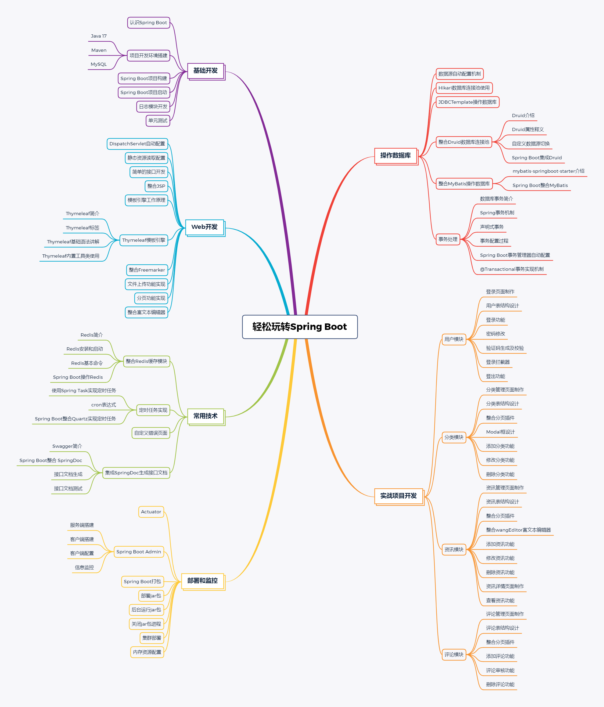

# 玩转 Spring Boot 系列案例源码

该系列是对 Spring Boot 入门系列代码的补充，Spring Boot 技术整合的更多案例，可以直接下载到本地编辑和使用。

- [spring-boot-logging](https://github.com/ZHENFENG13/spring-boot-projects/tree/master/玩转SpringBoot系列案例源码/spring-boot-logging)：Spring Boot 基础开发之日志输出案例
- [spring-boot-test](https://github.com/ZHENFENG13/spring-boot-projects/tree/master/玩转SpringBoot系列案例源码/spring-boot-test)：Spring Boot 基础开发之单元测试案例
- [spring-boot-message-converter](https://github.com/ZHENFENG13/spring-boot-projects/tree/master/玩转SpringBoot系列案例源码/spring-boot-message-converter)：Spring Boot 基础开发之消息转换器案例
- [spring-boot-druid](https://github.com/ZHENFENG13/spring-boot-projects/tree/master/玩转SpringBoot系列案例源码/spring-boot-druid)：Spring Boot 中使用自定义 Druid 数据源案例
- [spring-boot-transaction](https://github.com/ZHENFENG13/spring-boot-projects/tree/master/玩转SpringBoot系列案例源码/spring-boot-transaction)：Spring Boot 中的事务处理案例
- [spring-boot-redis](https://github.com/ZHENFENG13/spring-boot-projects/tree/master/玩转SpringBoot系列案例源码/spring-boot-redis)：Spring Boot 整合 Redis 操作缓存模块
- [spring-boot-schedule](https://github.com/ZHENFENG13/spring-boot-projects/tree/master/玩转SpringBoot系列案例源码/spring-boot-schedule)：Spring Boot 项目开发之@Scheduled实现定时任务案例
- [spring-boot-quartz](https://github.com/ZHENFENG13/spring-boot-projects/tree/master/玩转SpringBoot系列案例源码/spring-boot-quartz)：Spring Boot 项目开发之Quartz定时任务案例
- [spring-boot-error-page](https://github.com/ZHENFENG13/spring-boot-projects/tree/master/玩转SpringBoot系列案例源码/spring-boot-error-page)：Spring Boot 自定义错误页面案例
- [spring-boot-swagger](https://github.com/ZHENFENG13/spring-boot-projects/tree/master/玩转SpringBoot系列案例源码/spring-boot-swagger)：Spring Boot 集成 Swagger 生成接口文档案例
- [spring-boot-web-jsp](https://github.com/ZHENFENG13/spring-boot-projects/tree/master/玩转SpringBoot系列案例源码/spring-boot-web-jsp) ：Spring Boot 整合 JSP 开发 web 项目
- [spring-boot-web-thymeleaf](https://github.com/ZHENFENG13/spring-boot-projects/tree/master/玩转SpringBoot系列案例源码/spring-boot-web-thymeleaf) ：Spring Boot 整合 Thymeleaf 案例
- [spring-boot-web-thymeleaf-syntax](https://github.com/ZHENFENG13/spring-boot-projects/tree/master/玩转SpringBoot系列案例源码/spring-boot-web-thymeleaf-syntax) ：Thymeleaf 语法详解
- [spring-boot-web-freemarker](https://github.com/ZHENFENG13/spring-boot-projects/tree/master/玩转SpringBoot系列案例源码/spring-boot-web-freemarker) ：Spring Boot 整合 FreeMarker 案例
- [spring-boot-admin](https://github.com/ZHENFENG13/spring-boot-projects/tree/master/玩转SpringBoot系列案例源码/spring-boot-admin) ：Spring Boot Admin 整合使用案例

## 课程地址

- [**课程地址:https://www.lanqiao.cn/courses/1274**](https://www.lanqiao.cn/courses/1274)

## 课程的五大特色

- **课程内容紧贴 Spring Boot 技术栈，涵盖大部分 Spring Boot 使用场景**
- **开发教程详细完整、文档资源齐全、实验过程循序渐进简单明了**
- **实践项目页面美观且实用，交互效果完美**
- **包含从零搭建项目、功能开发到网站上线的完整流程**
- **丰富你的开发技术栈，提升个人市场价值**

本课程内容主要是抛砖引玉，根据该实践项目中所讲解的技术和开发技巧以及各个单独的功能点实现，可以结合自身业务将其改造成任何企业开发项目，关于整个训练营课程中的所有知识点，我也整理了一个思维导图帮助大家更好的归纳和理解（如果网页上看不清楚的话可以放大查看）：

## 课程介绍

本课程是一个 Spring Boot 技术栈由入门到精通的实战类课程，课程共分为 6 个部分，如上图所示，分别是：

- Spring Boot 基础开发
- Spring Boot web 开发
- Spring Boot 对于数据库的操作
- Spring Boot 使用扩展
- Spring Boot 项目的部署和监控
- Spring Boot + Thymeleaf + MyBatis + AdminLTE3 开发资讯发布系统

前面四个部分为基础环境准备以及 Spring Boot 项目实践开发，这些内容主要是为了让大家能够掌握 Spring Boot 的开发和使用，**旨在让读者更加熟悉 Spring Boot 及企业开发中需要注意的事项并具有使用 Spring Boot 技术进行大部分企业项目功能开发的能力；**第五部分是项目上线过程中的一些知识点整理以及上线后如何进行项目监控，**旨在让读者不仅仅能够开发 Spring Boot 项目，也能够实际的上线项目、监控项目、维护项目；**最后一部分为项目实践部分，我会带着大家实际的开发一个 Spring Boot + Thymeleaf + MyBatis + AdminLTE3  的资讯发布系统，让大家实际操作并从无到有开发一个线上项目，并学习到一定的开发经验以及其中的开发技巧，**旨在让读者具有将 Spring Boot 真正应用于项目开发的能力；**

---

## 交流

> 大家有任何问题或者建议都可以在 [issues](https://github.com/ZHENFENG13/springboot-projects/issues) 中反馈给我，我会慢慢完善这个 Spring Boot 仓库。

- 我的邮箱：2449207463@qq.com
- QQ技术交流群：784785001
